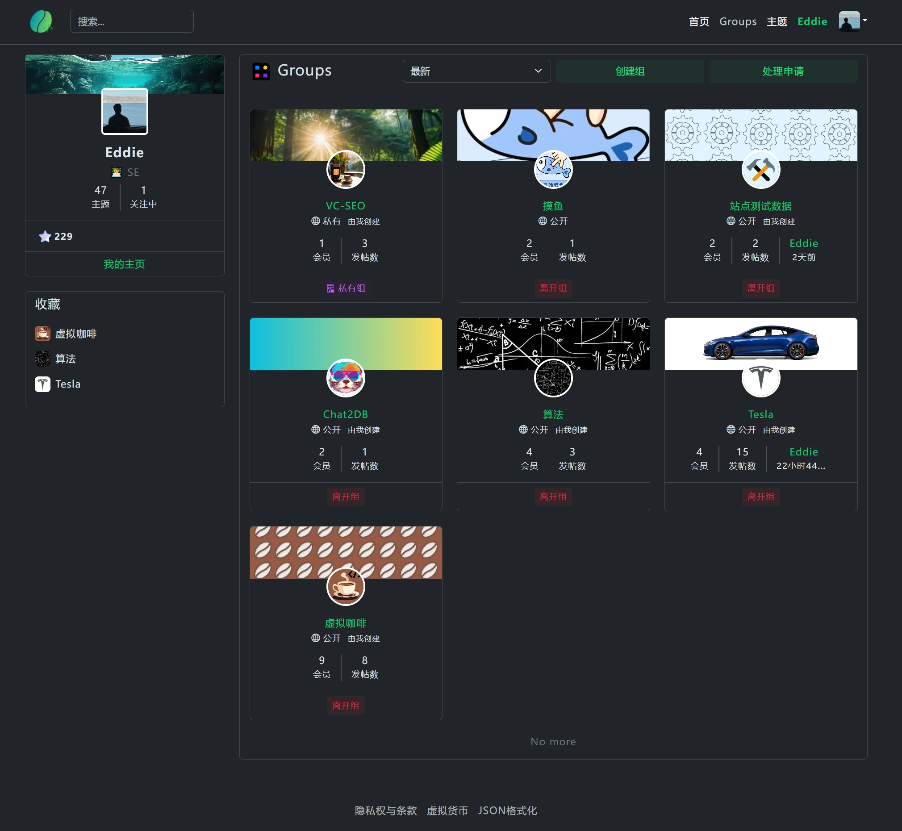
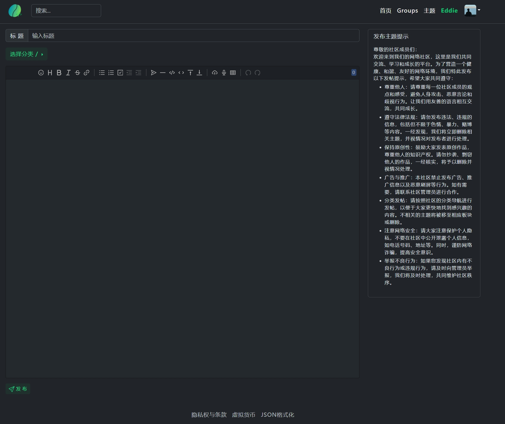

  
现代化网络主题社区，独特的线上空间
  
Modern online theme community, unique online space
  

# 🍳 介绍
💻☕️ 现代化网络主题社区，独特的线上空间

**https://kafeih.com/**

**避免滥用请使用邀请码 eddie**

一个独特的线上平台——虚拟咖啡社区。这个社区专为热爱咖啡文化的朋友们以及编程爱好者们打造，为大家提供了一个互动交流、分享经验的线上空间。

在这里，你可以结识志同道合的朋友，一起探讨咖啡的品鉴技巧、冲泡方法，以及世界各地的咖啡文化。同时，作为编程爱好者，你还可以在这个平台上分享你的编程心得、项目经验，与其他开发者共同进步，也让你在享受咖啡的同时，不断提升自己的技能。

快来加入我们吧！让我们一起在虚拟咖啡社区里品味咖啡的魅力，感受编程的乐趣！🌈 ☕️ 💻

**如果你对此站点感兴趣虚拟咖啡非常欢迎您**

**如果你对此无兴趣请不要点击链接和刻意破坏**

💻☕️ Virtual Coffee Community: An Online Gathering Place for Coffee Culture Enthusiasts and Programming Lovers

**https://kafeih.com/**

**Invitation code: eddie**

Hello everyone! I would like to introduce you to a unique online platform - Virtual Coffee Community. This community is dedicated to friends who love coffee culture and programming enthusiasts, providing an interactive and shared experience online space.

Here, you can meet like-minded friends, discuss coffee tasting skills, brewing methods, and coffee cultures from around the world. As a programming enthusiast, you can also share your programming insights, project experiences, and make progress together with other developers on this platform. While enjoying coffee, you can continue to improve your skills.

Join us now! Let's taste the charm of coffee and feel the fun of programming together in the Virtual Coffee Community! 🌈 ☕️ 💻

This is a brand new website, looking forward to your production of interesting content.

**If you are interested in this site, Virtual Coffee warmly welcomes you.**

**If you are not interested, please do not click on the link and deliberately damage it.**

# 🍧 特性界面展示
### 组

### 组内Feeds

### 个人主页

### 主题列表

### 主题内容

### 创建主题

### 通知

# 🏡 社区
- [讨论区](https://kafeih.com/team-details/1785499718915141632)
- [报告问题](https://kafeih.com/team-details/1785500190661095424)

# 📜 授权
- 本项目使用 AGPLv3 开源，如果你个人使用则必须完全遵守 AGPLv3 的相关条款；
- 本项目使用 AGPLv3 开源，如果公司使用必须购买商用授权；

# 🎉 鸣谢
- [Vditor： 浏览器端的 Markdown 编辑器](https://github.com/Vanessa219/vditor)

